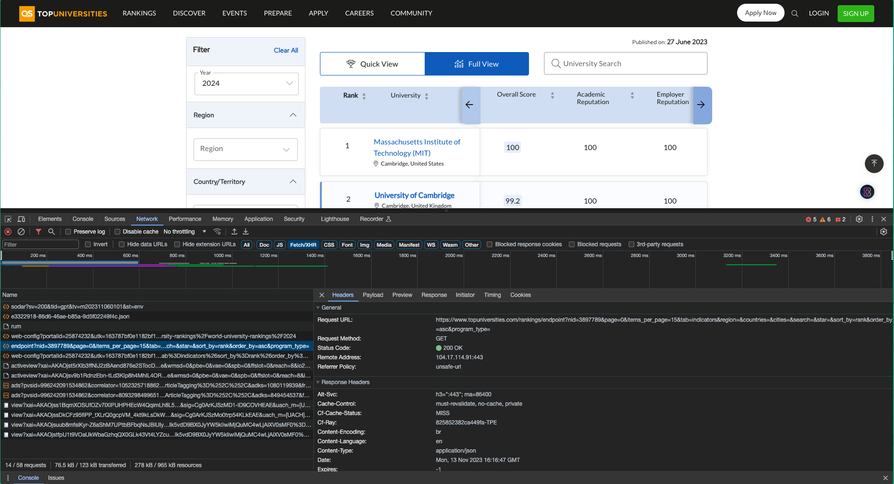

# LATIA112-1 HW02

## Virtual Environment

Recommend to use venv to isolate your environment.

```bash
$ python3.9 -m venv venv
$ source venv/bin/activate
```

## Dependancy

* Requirements.txt

  * ```bash
    $ pip install -r requirements.txt
    ```
* Chromedriver for MacOS
  * ```bash
    $ brew install --cask chromedriver
    ```

## Specified Items in Assignment
- [x] Beautiful Soap
- [x] Selenium
- [x] Scrapy 

## How To Use My Scrapy Code

1. Install the dependancies
2. Note that `file.csv` already exist in codebase, hence you **MAY CHANGE THE NAME TO THE OTHER** so as not to keep writing the data into `file.csv`. 
    ```bash
    $ cd Scrapy_topUniversity
    $ scrapy crawl topUniversity -o file.csv
    ```

In my code, I am dealing with a Dynamic JS Website, where the data in the table is loaded dynamically. To retrieve the corresponding data, I have opted to use the website's API endpoint. 

The method to obtain the endpoint involves opening the Network tab, selecting the Fetch/XHR filter tag, refreshing the webpage, and identifying the relevant keyword in the name file associated with the endpoint. By choosing the header, the request URL, which is the desired API endpoint, can be found. This approach allows for the successful retrieval of data in JSON content type.



## Use My Beautiful_Soup_and_Selenium Code

> In this practice, I integrate the methods specified in the tasks from homework for **Selenium** and **Beautiful Soup** to create a web crawler for a particular website. At last, I reached the goal, which is to parse the data and save it as a CSV file.

1. Install the dependancies
2. Check your Chrome Driver is executed or not
3. ```bash
    $ cd Beautiful_Soup_and_Selenium
    $ python main.py
    ```

**Please note that data is exclusively retrieved using the keyword 'Minecraft'. You can modify the keyword at line 129 in the `main.py` file.**

## Material

* [QS World University Rankings 2024: Top global universities](https://www.topuniversities.com/university-rankings/world-university-rankings/2024)
* [IEEE Xplore](https://ieeexplore.ieee.org/Xplore/home.jsp)
